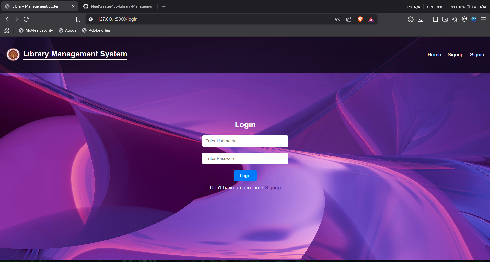
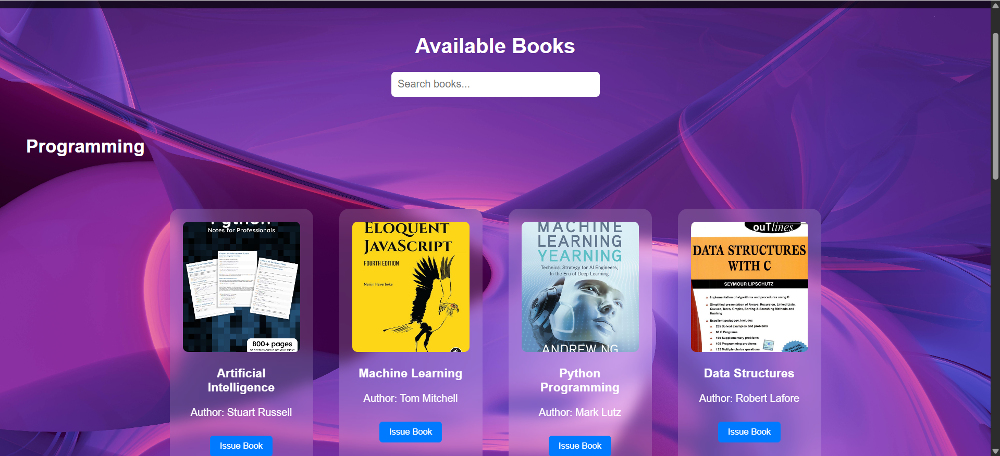
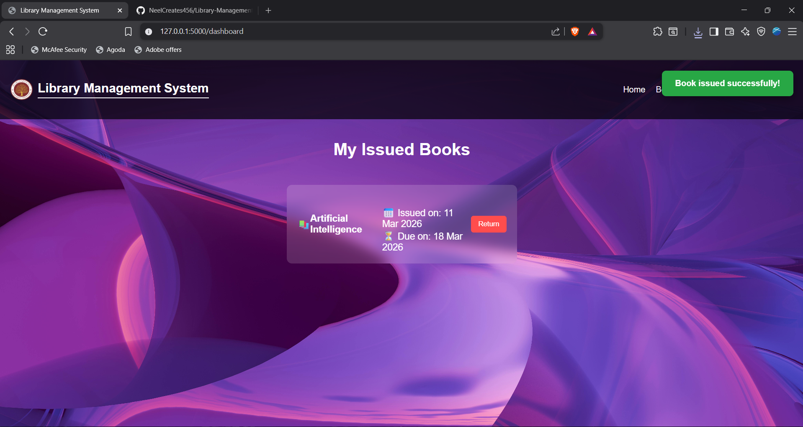
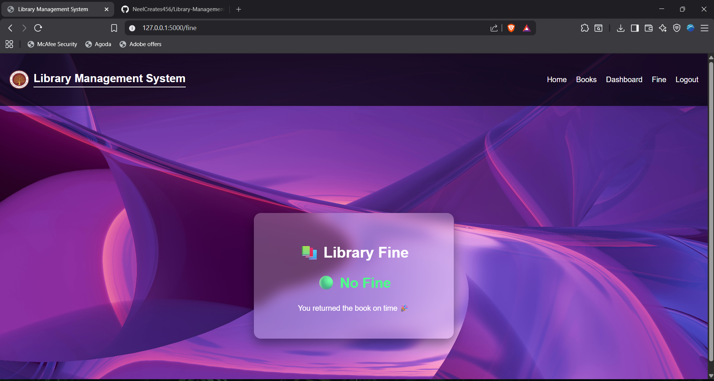

# Library Management System

A web-based Library Management System built using **Flask, HTML, CSS, and JavaScript**.

## Features

- User Signup and Login System
- View Available Books
- Issue Books
- Return Books
- Fine Calculation for Late Returns
- Dashboard to Track Issued Books

## Technologies Used

- Python
- Flask
- HTML
- CSS
- JavaScript

## Project Structure
app.py templates/ static/
## How to Run

1. Install Flask
    pip install flask
2. Run the application
   python app.py
3. Open in browser
   http://127.0.0.1:5000⁠

   ## Author

   ## Project Screenshots

### Login Page

### Books Page

### Dashboard

### Fine Calculation

Nirmalya  
B.Tech CSE (AI & ML)
